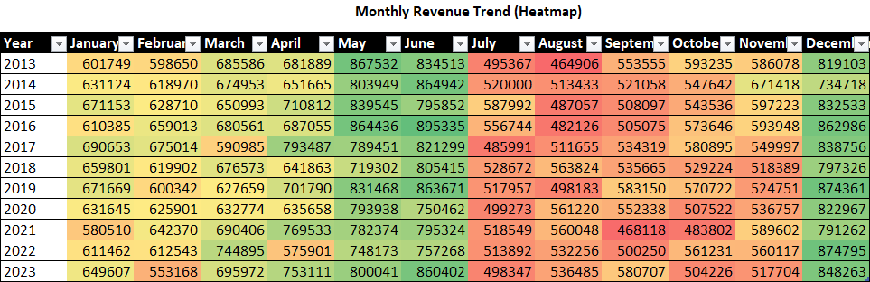
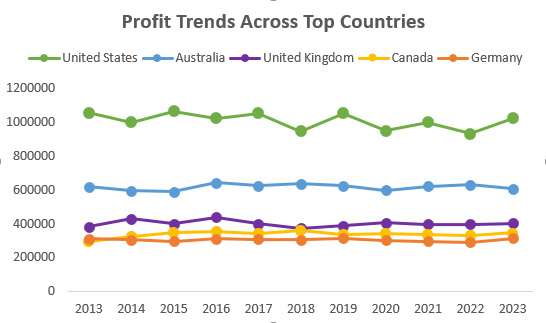

# World Bike Sales Dashboard

## Overview
This project analyzes world bike sales data to uncover actionable trends and insights for business decision-making. Using Excel for data cleaning, analysis, and visualization, an interactive dashboard was developed to help stakeholders monitor revenue, profit, customer behavior, and product performance in real-time. The goal is to provide clear, data-driven insights that support business growth, profitability, and customer satisfaction.

## Methodology
- ### Data Cleaning:
    The dataset was first cleaned to remove duplicates and unnecessary columns.
- ### Analysis:
    Pivot tables, calculated fields, and various chart types (e.g., bar, line, treemap) were used to analyze trends in revenue, profit, and customer behavior.
- ### Dashboard Creation:
    An interactive dashboard was created in Excel to visually display the insights and allow stakeholders to filter and explore key metrics.

## Objectives 
- ### Present Revenue and Profit by year and country:
    Analyze and visualize revenue and profit trends across different countries over time.
- ### Identify customer demographics and behavior:
    Analyze how purchasing patterns differ by age, gender, and customer type to identify high-value customer segments and optimize marketing strategies.
- ### Evaluate Eco-Friendly Product Performance:
    Assess how eco-friendly products perform in comparison with non-eco-friendly one in terms of revenue, profit and customer satisfaction.
- ### Identify profit per country
    Analyze the profitability of different product categories to determine which categories contribute the most to overall profit.


---

## Repository Structure
```
world-bike-sales-dashboard/
│
├── dashboard/
│   ├── bike_sales_data_world_2013_2023.xlsx     # Excel dashboard with pivot tables
│
├── images/
│   ├── Monthly_Revenue_Trend.png
│   ├── Profit_Per_Country.png 
│   ├── Revenue_Cost_Profit_Per_Year.png
│
├── README.md                     # Project documentation (this file)
└── LICENSE                       # License for the project
```

---

## Dashboard Highlights
-  **Revenue, Cost & Profit By Year**
    
- **Monthly Revenue Trend**
    
-  **Profit Trends Across Top Countries**<br>
    

## Future Enhancements
### Next Steps:
- Incorporate additional data like customer feedback and product return rate for deeper insights.
- Enhance the dashboard by adding predictive analytics or forecasting features for future sales trends.
- Develop a more interactive and user-friendly dashboard using more advanced tools like Power BI or Tableau. 
